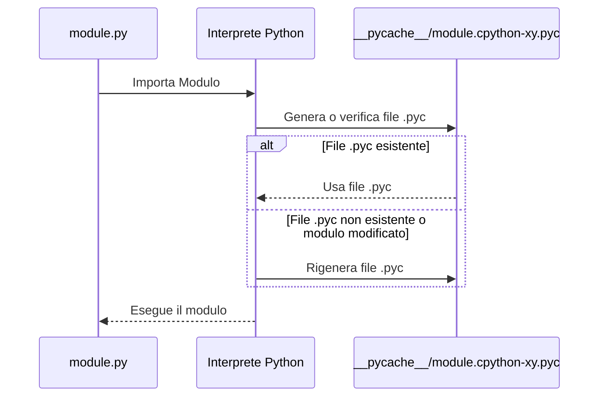
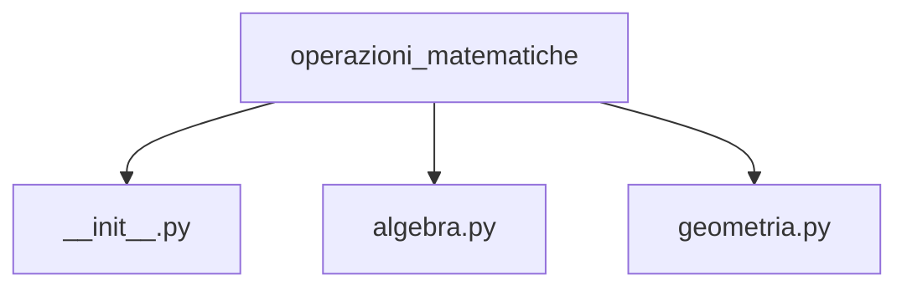

# Package
<ImageComponent 
  src="/CodeInMind/package.png" 
  alt="Description of the image" 
  :width="200" 
/>

As your project grows, you might find yourself with many modules. This could cause some confusion. 
Just as we group functions within modules, sooner or later you will need to **group the modules themselves**.

## Containers for modules
In the world of modules, a **package** plays the same role that a folder or directory has in the world of files.
A **package** is a collection of modules grouped in a hierarchical structure. It allows you to better organize your code, especially when working on large projects or with many modules. In practice, a package is a folder that contains one or more modules, with the addition of a special file called `__init__.py`.

## PyCache
When you import a module in Python, the language performs an operation behind the scenes that involves the **__pycache__** folder and **.pyc** files.
When you import a module for the first time, Python doesn't immediately execute the source code as is. Instead, it first **translates it into a semi-compiled format**.
This compiled version of the code is not machine code, but a Python-specific format, called **bytecode**. It is designed to be executed by the Python interpreter faster than the source code.
### The __pycache__ folder
After importing a module, if you take a look in the folder where the module file is located, you will notice a new folder called **__pycache__**. This folder contains the compiled Python files with the **.pyc** extension.
### What are .pyc files?
A **.pyc** file contains the compiled bytecode of the module. The file name will be similar to **module.cpython-xy.pyc**, where:
- **module** is the name of the original module.
- **cpython** indicates the implementation of Python that created the file (CPython is the most common implementation of Python).
- **xy** represents the Python version (for example, **38** for Python 3.8).
- **.pyc** means that it is a compiled Python file.

### Perché Python crea questi file?

L'obiettivo è ottimizzare l'esecuzione del programma:
- **Velocità di esecuzione**: Poiché il bytecode è già stato compilato, l'importazione successiva del modulo sarà più veloce rispetto a interpretare di nuovo il codice sorgente.
- **Riconoscimento automatico delle modifiche**: Python verifica se il file sorgente del modulo è stato modificato. Se sì, rigenera automaticamente il file **.pyc**. Se non ci sono modifiche, Python esegue direttamente il file compilato.



## Creazione di un Package

Creare un **package** in Python è molto semplice. Segui questi passi:

1. **Crea una cartella** che rappresenta il tuo package.
2. All'interno della cartella, **inserisci i tuoi moduli** (file `.py`).
3. Aggiungi un file vuoto chiamato **`__init__.py`** all'interno della cartella. Questo file indica a Python che la cartella deve essere trattata come un package.

Ad esempio:

```
mio_package/
init.py
modulo1.py
modulo2.py
```

In questo caso, `mio_package` è il package che contiene i moduli `modulo1.py` e `modulo2.py`. Ora puoi importare questi moduli all'interno del tuo codice come segue:

```python
from mio_package import modulo1
from mio_package import modulo2
```

## Esempio

Supponiamo di voler creare un package per gestire operazioni matematiche. Creiamo una cartella chiamata `operazioni_matematiche` con la seguente struttura:



Il file `algebra.py` potrebbe contenere funzioni per operazioni algebriche, mentre `geometria.py` funzioni per operazioni geometriche. 

Ecco come importare e utilizzare queste funzioni:

```python
from operazioni_matematiche.algebra import somma
from operazioni_matematiche.geometria import area_cerchio

somma(3, 4)
area_cerchio(5)
```