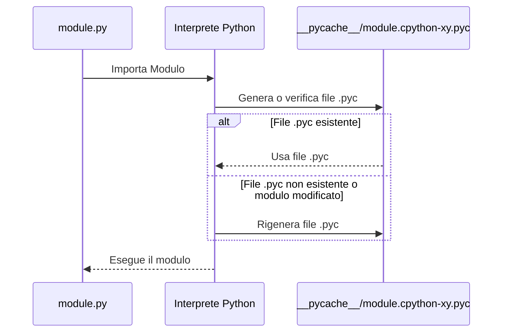
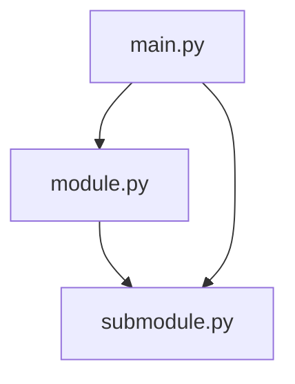

# Moduli in Python

Il codice tende a crescere, e con esso aumentano anche le difficoltà nella sua manutenzione. Un codice grande è più complesso da gestire e debugare, e per progetti di grandi dimensioni è indispensabile suddividere il lavoro tra più sviluppatori.

Per farlo, è necessario dividere il codice in parti più piccole e indipendenti che possano collaborare tra loro. In Python, questa suddivisione si realizza tramite i **moduli**.

## Perché usare i Moduli?

I moduli consentono di organizzare il codice in unità più gestibili, ognuna con una funzione specifica. Questo approccio porta diversi vantaggi:

- **Manutenibilità**: Il codice è più semplice da leggere, aggiornare e testare.
- **Collaborazione**: Più sviluppatori possono lavorare contemporaneamente su parti diverse del progetto.
- **Riutilizzabilità**: I moduli possono essere riutilizzati in altri progetti o in altre parti dello stesso progetto.

## Esempio di decomposizione

Un grande progetto, come un'applicazione con interfaccia grafica, potrebbe essere suddiviso in:

1. **Interfaccia utente**: La parte che interagisce con l'utente tramite schermate e widget.
2. **Logica**: La parte che elabora i dati e produce risultati.

Ciascuna di queste parti può essere ulteriormente suddivisa in moduli più piccoli.

<NoteComponent title="Decomposizione" text="La decomposizione in informatica, nota anche come factoring, consiste nel suddividere un problema o un sistema complesso in parti più semplici." />

## Come utilizzare un modulo?

Cos'è un modulo? Il tutorial di Python lo definisce come un file contenente definizioni e istruzioni Python, che può essere successivamente importato e utilizzato quando necessario.

La gestione dei moduli consiste in due situazioni distinte:

- **Utente del modulo**: La prima (probabilmente la più comune) si verifica quando vuoi usare un modulo già esistente, scritto da qualcun altro o creato da te stesso durante il lavoro su un progetto complesso. In questo caso sei l'utente del modulo.
  
- **Fornitore del modulo**: La seconda situazione si verifica quando vuoi creare un modulo completamente nuovo, sia per il tuo uso personale, sia per rendere più facile la vita di altri programmatori. In questo caso, sei il fornitore del modulo.

## Identificazione di un modulo

Un modulo è identificato dal suo nome. 

Python fornisce un certo numero di moduli quando viene installato.

Tutti questi moduli, insieme alle **built-in functions**, formano la **Python Standard Library** - una sorta di biblioteca speciale. 

::: tip Python Standard Library
Dagli un'occhiata: [Python Standard Library](https://docs.python.org/3/library/index.html)
:::

Ogni modulo è composto da **entità** (come un libro è composto da capitoli). Queste entità possono essere **funzioni**, **variabili**, **costanti**, **classi** e **oggetti**. 

Se sai come accedere a un determinato modulo, puoi utilizzare tutte le **entità** che contiene.

## Importare un Modulo

Prima di usare un modulo devi importarlo tramite la **keyword** `import`.

Ad esempio per importare il modulo `math`

``` python
import math
```

L'istruzione `import` può trovarsi ovunque nel tuo codice, a patto che sia prima dell'utilizzo delle **entità** del modulo.

E' possibile anche importare più di un modulo alla volta

``` python
import math, random
```

::: tip
Per maggiori informazioni su come importare un modulo visitare la sezione [Namespace e Importazione](namespace.md#importazione-di-un-modulo)
:::

### sys.path

Di default, Python cerca nella **directory corrente** e in altre **directory predefinite**. E' possibile però aggiungere nuove directory in cui cercare i moduli.

Qui entra in gioco la lista `sys.path`, che specifica le directory in cui Python deve cercare i moduli.

Se Python non trova il modulo della directory corrente, cerca nelle directory elencate in `sys.path`.

Puoi visualizzare la lista dei percorsi eseguendo questo codice

``` python
import sys

for p in sys.path:
    print(p)
```

L'output sarà una lista di directory in cui Python cerca i moduli

``` text
C:\Users\user
C:\Users\user\AppData\Local\Programs\Python\Python36-32\python36.zip
C:\Users\user\AppData\Local\Programs\Python\Python36-32\DLLs
C:\Users\user\AppData\Local\Programs\Python\Python36-32\lib
C:\Users\user\AppData\Local\Programs\Python\Python36-32
C:\Users\user\AppData\Local\Programs\Python\Python36-32\lib\site-packages
```

::: tip
Python cerca i moduli in tutti i percorsi specificati nel `sys.path` **in ordine**!. 
:::

Per aggiungere un percorso alla lista `sys.path` puoi utilizzare due metodi:

#### sys.path.insert()

Per dare priorità al nuovo percorso, puoi aggiungerlo all'inizio della lista `sys.path`:

``` python
from sys import path

# Inserisci il nuovo percorso all'inizio della lista
sys.path.insert(0, '/path/to/module')

# Ora puoi importare il modulo
import module
```

#### sys.path.append()

Per aggiungere il nuovo percorso alla fine della lista `sys.path`:

```python
from sys import path

# Aggiungi il nuovo percorso alla fine della lista
sys.path.append('/path/to/module')

# Ora puoi importare il modulo
import module
```

## Linea Shebang

La linea **Shebang** e viene utilizzata principalmente dai sistemi **Unix** o **Unix-like** per specificare quale interprete deve essere usato per eseguire lo script.

``` python
#!/usr/bin/env python3 
```

## Docstring

Le **docstring** del modulo descrivono il suo contenuto.

``` python
#!/usr/bin/env python3

""" module.py - commento """
```

## Variabili Globali

Le variabili globali di un modulo sono accessibili da tutti i moduli che lo importano.

E' possibile anche definire variabili private, cioè accessibili solo all'interno del modulo.

``` python
#!/usr/bin/env python3

""" module.py - commento """

__my_var = 10
```

::: tip
In Python non esiste una vera e propria variabile privata, ma si può utilizzare il doppio underscore `__` per indicare che una variabile è pseudo privata.
:::

## PyCache

Quando importi un modulo in Python, il linguaggio compie un'operazione dietro le quinte che coinvolge il folder **__pycache__** e i file **.pyc**.

Quando importi un modulo per la prima volta, Python non esegue immediatamente il codice sorgente così com'è. Invece, prima lo **traduce in un formato semi-compilato**.

Questa versione compilata del codice non è codice macchina, ma un formato specifico di Python, chiamato **bytecode**. È pensato per essere eseguito dall'interprete Python più velocemente rispetto al codice sorgente.

### Il folder __pycache__

Dopo aver importato un modulo, se dai un'occhiata nella cartella dove si trova il file del modulo, noterai un nuovo folder chiamato **__pycache__**. Questo folder contiene i file compilati di Python con estensione **.pyc**.

### Cosa sono i file .pyc?

Un file **.pyc** contiene il bytecode compilato del modulo. Il nome del file sarà simile a **module.cpython-xy.pyc**, dove:
- **module** è il nome del modulo originale.
- **cpython** indica l'implementazione di Python che ha creato il file (CPython è l'implementazione più comune di Python).
- **xy** rappresenta la versione di Python (ad esempio, **38** per Python 3.8).
- **.pyc** significa che è un file compilato di Python.

### Perché Python crea questi file?

L'obiettivo è ottimizzare l'esecuzione del programma:
- **Velocità di esecuzione**: Poiché il bytecode è già stato compilato, l'importazione successiva del modulo sarà più veloce rispetto a interpretare di nuovo il codice sorgente.
- **Riconoscimento automatico delle modifiche**: Python verifica se il file sorgente del modulo è stato modificato. Se sì, rigenera automaticamente il file **.pyc**. Se non ci sono modifiche, Python esegue direttamente il file compilato.



## Approfondimento

Quando un modulo viene importato, il suo contenuto viene **implicitamente** eseguito.

Questo permette al modulo di inizializzare variabili, definire funzioni e classi, e fare altre operazioni.

Ad esempio immaginiamo di voler importare un modulo `module` e `submodule`, dove però `module` importa `submodule`.



::: code-group
``` python [main.py]
import module
import submodule

print("Main")
```

``` python [module.py]

import submodule

print("Module")
```

``` python [submodule.py]
print("I'm a submodule")
```
:::

In questo caso stiamo importando `submodule` due volte: una volta da `module` e una volta direttamente. 

Fortunatamente, Python è intelligente e non esegue due volte lo stesso modulo.

``` text
I'm a submodule
Module
Main
```

In oltre Python crea una variabile chiamata `__name__` che contiene il nome del modulo.

- Se il modulo è eseguito direttamente, `__name__` sarà uguale a `__main__`.
- Se il modulo è importato, `__name__` sarà uguale al nome del modulo.

Questa variabile viene spesso utilizzata per eseguire porzioni di codice solo quando il modulo viene direttamente eseguito.

Ad esempio, possiamo inserire nel blocco condizionale `if __name__ == "__main__":` un test per verificare che la funzione `somma` funzioni correttamente.

``` python
def somma(a, b):
    return a + b

if __name__ == "__main__":
    assert somma(3, 4) == 7
```