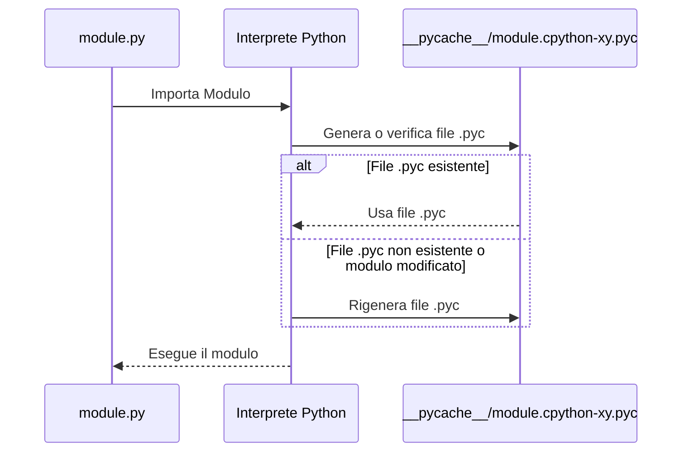
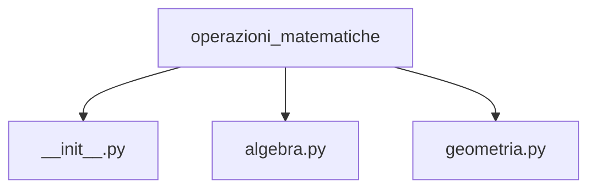

# Package

<ImageComponent 
  src="/CodeInMind/package.png" 
  alt="Description of the image" 
  :width="200" 
/>

Man mano che il tuo progetto cresce, potresti trovarti con molti moduli. Questo potrebbe causare un po' di confusione. 

Così come raggruppiamo le funzioni all'interno di moduli, prima o poi avrai bisogno di **raggruppare i moduli stessi**.

## Contenitori per moduli

Nel mondo dei moduli, un **package** gioca lo stesso ruolo che una cartella o directory ha nel mondo dei file.

Un **package** è un insieme di moduli raggruppati in una struttura gerarchica. Ti permette di organizzare meglio il tuo codice, soprattutto quando lavori su progetti di grandi dimensioni o con molti moduli. In pratica, un package è una cartella che contiene uno o più moduli, con l'aggiunta di un file speciale chiamato `__init__.py`.

## PyCache

Quando importi un modulo in Python, il linguaggio compie un'operazione dietro le quinte che coinvolge il folder **__pycache__** e i file **.pyc**.

Quando importi un modulo per la prima volta, Python non esegue immediatamente il codice sorgente così com'è. Invece, prima lo **traduce in un formato semi-compilato**.

Questa versione compilata del codice non è codice macchina, ma un formato specifico di Python, chiamato **bytecode**. È pensato per essere eseguito dall'interprete Python più velocemente rispetto al codice sorgente.

### Il folder __pycache__

Dopo aver importato un modulo, se dai un'occhiata nella cartella dove si trova il file del modulo, noterai un nuovo folder chiamato **__pycache__**. Questo folder contiene i file compilati di Python con estensione **.pyc**.

### Cosa sono i file .pyc?

Un file **.pyc** contiene il bytecode compilato del modulo. Il nome del file sarà simile a **module.cpython-xy.pyc**, dove:
- **module** è il nome del modulo originale.
- **cpython** indica l'implementazione di Python che ha creato il file (CPython è l'implementazione più comune di Python).
- **xy** rappresenta la versione di Python (ad esempio, **38** per Python 3.8).
- **.pyc** significa che è un file compilato di Python.

### Perché Python crea questi file?

L'obiettivo è ottimizzare l'esecuzione del programma:
- **Velocità di esecuzione**: Poiché il bytecode è già stato compilato, l'importazione successiva del modulo sarà più veloce rispetto a interpretare di nuovo il codice sorgente.
- **Riconoscimento automatico delle modifiche**: Python verifica se il file sorgente del modulo è stato modificato. Se sì, rigenera automaticamente il file **.pyc**. Se non ci sono modifiche, Python esegue direttamente il file compilato.



## Creazione di un Package

Creare un **package** in Python è molto semplice. Segui questi passi:

1. **Crea una cartella** che rappresenta il tuo package.
2. All'interno della cartella, **inserisci i tuoi moduli** (file `.py`).
3. Aggiungi un file vuoto chiamato **`__init__.py`** all'interno della cartella. Questo file indica a Python che la cartella deve essere trattata come un package.

Ad esempio:

```
mio_package/
init.py
modulo1.py
modulo2.py
```

In questo caso, `mio_package` è il package che contiene i moduli `modulo1.py` e `modulo2.py`. Ora puoi importare questi moduli all'interno del tuo codice come segue:

```python
from mio_package import modulo1
from mio_package import modulo2
```

## Esempio

Supponiamo di voler creare un package per gestire operazioni matematiche. Creiamo una cartella chiamata `operazioni_matematiche` con la seguente struttura:



Il file `algebra.py` potrebbe contenere funzioni per operazioni algebriche, mentre `geometria.py` funzioni per operazioni geometriche. 

Ecco come importare e utilizzare queste funzioni:

```python
from operazioni_matematiche.algebra import somma
from operazioni_matematiche.geometria import area_cerchio

somma(3, 4)
area_cerchio(5)
```